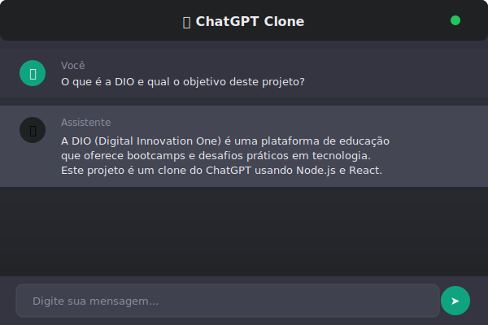
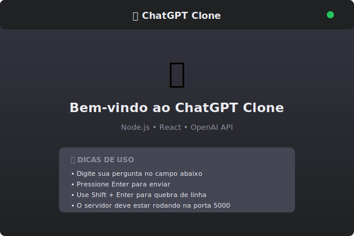

<div align="center">

<!-- Banner animado com SVG -->


<br>

<!-- Badges de qualidade -->
[](https://github.com/matheusflorindo32/chatgpt-clone-dio/stargazers)
[](https://github.com/matheusflorindo32/chatgpt-clone-dio/network)
[](https://github.com/matheusflorindo32/chatgpt-clone-dio/issues)
[](LICENSE)

<!-- Badges de tecnologias -->


<br>

<!-- Tagline -->
<p align="center">
  <b>🚀 Clone funcional do ChatGPT desenvolvido como desafio prático da DIO</b><br>
  <i>Backend seguro • Interface moderna • Integração OpenAI • Código profissional</i>
</p>

</div>

---

<!-- Índice animado -->
## 📑 Índice

- [🎬 Demonstração](#-demonstração)
- [✨ Funcionalidades](#-funcionalidades)
- [🏗️ Arquitetura](#️-arquitetura)
- [🛠️ Tecnologias](#️-tecnologias)
- [📁 Estrutura](#-estrutura)
- [🚀 Instalação](#-instalação)
- [🌐 Deploy em Produção](#-deploy-em-produção)
- [⚙️ Configuração](#️-configuração)
- [🔒 Segurança](#-segurança)
- [📚 Aprendizados](#-aprendizados)
- [🔮 Roadmap](#-roadmap)
- [👨‍💻 Autor](#-autor)
- [🙏 Créditos](#-créditos)
- [📄 Licença](#-licença)

---

## 🎬 Demonstração

<div align="center">

### 🌐 Acesse Online

| 🎨 Frontend (Vercel) | ⚙️ Backend (Railway) |
|:---:|:---:|
| [**🔗 chatgpt-clone-dio.vercel.app**](https://chatgpt-clone-aluvpq5w6-matheusflorindo32s-projects.vercel.app/) | [**🔗 API Status**](https://chatgpt-clone-dio-production.up.railway.app/health) |

> 💡 **O frontend está no Vercel** e o backend protegido no Railway

<!-- Placeholder para GIF/Screenshot -->
| 💬 Chat em Ação | 🏠 Tela de Boas-vindas |
|:---:|:---:|
|  |  |

> 📸 **Substitua** os placeholders acima por screenshots reais do projeto na pasta `docs/screenshots/`

</div>

---

## ✨ Funcionalidades

<div align="center">

| Funcionalidade | Status | Detalhes |
|:---:|:---:|:---|
| 💬 Chat em tempo real | ✅ | Envie mensagens e receba respostas da IA |
| 🤖 Integração OpenAI | ✅ | API protegida no backend via variável de ambiente |
| 🎨 Design moderno | ✅ | Tema escuro inspirado no ChatGPT oficial |
| 📱 Responsivo | ✅ | Funciona em desktop, tablet e mobile |
| ⚡ Indicador de digitação | ✅ | Animação de "pensando..." enquanto a IA responde |
| 🗑️ Limpar conversa | ✅ | Botão com confirmação de exclusão |
| 🟢 Status do servidor | ✅ | Indicador em tempo real de conexão |
| ⌨️ Atalhos de teclado | ✅ | Enter envia, Shift+Enter quebra linha |
| ❌ Tratamento de erros | ✅ | Mensagens amigáveis para cada tipo de erro |
| 📝 Boas-vindas | ✅ | Tela inicial com dicas de uso |

</div>

---

## 🏗️ Arquitetura

```mermaid
%%{init: {'theme': 'dark', 'themeVariables': { 'primaryColor': '#10a37f', 'primaryTextColor': '#fff', 'primaryBorderColor': '#10a37f', 'lineColor': '#10a37f', 'secondaryColor': '#444654', 'tertiaryColor': '#343541'}}}%%
graph LR
    subgraph FRONTEND["🖥️ FRONTEND — React + Vite"]
        A["App.jsx<br/>Gerenciamento de Estado"] --> B["ChatInput.jsx"]
        A --> C["ChatMessage.jsx"]
        A --> D["Sidebar.jsx"]
        A --> E["Header.jsx"]
        B --> F["api.js<br/>Axios Client"]
    end

    subgraph BACKEND["⚙️ BACKEND — Node.js + Express"]
        G["server.js<br/>Porta 5000"] --> H["POST /api/chat"]
        G --> I["GET /health"]
        H --> J["OpenAI SDK<br/>Protegido por .env"]
    end

    subgraph EXTERNAL["🌐 EXTERNAL"]
        K["OpenAI API<br/>gpt-3.5-turbo"]
    end

    F -->|"HTTP POST<br/>{message}"| G
    J -->|"API Key<br/>Segura"| K
    K -->|"JSON<br/>{reply}"| J
    J -->|"JSON<br/>{reply}"| F

    style FRONTEND fill:#1a1a2e,stroke:#10a37f,stroke-width:2px
    style BACKEND fill:#1a1a2e,stroke:#10a37f,stroke-width:2px
    style EXTERNAL fill:#1a1a2e,stroke:#10a37f,stroke-width:2px
```



> 🔐 **Segurança:** A chave da API OpenAI NUNCA é exposta no frontend. Todas as chamadas passam pelo backend seguro.

---

## 🛠️ Tecnologias

<div align="center">

### Backend
| Tecnologia | Versão | Propósito |
|:---:|:---:|:---|
|  | 18+ | Runtime JavaScript |
|  | 4.21+ | Framework web |
|  | — | Gerenciador de pacotes |

### Frontend
| Tecnologia | Versão | Propósito |
|:---:|:---:|:---|
|  | 18.3+ | Biblioteca UI |
|  | 5.4+ | Build tool |
|  | ES6+ | Linguagem |
|  | 3 | Estilização |

### APIs & Ferramentas
| Tecnologia | Versão | Propósito |
|:---:|:---:|:---|
|  | SDK 4.67+ | Inteligência Artificial |
|  | — | Versionamento |
|  | — | Repositório remoto |

</div>

---

## 📁 Estrutura

```
📦 chatgpt-clone-dio
│
├── 📂 server/                          # 🖥️ Backend Node.js
│   ├── 📄 package.json                 # Dependências do servidor
│   ├── 📄 server.js                    # Entry point Express
│   └── 📄 .env.example                 # Template de variáveis de ambiente
│
├── 📂 web/                             # 🎨 Frontend React
│   ├── 📄 package.json                 # Dependências do cliente
│   ├── 📄 vite.config.js               # Configuração do Vite
│   ├── 📄 index.html                   # HTML base
│   ├── 📄 vercel.json                  # Configuração do Vercel
│   ├── 📄 .env.example                 # Template de variáveis do frontend
│   └── 📂 src/
│       ├── 📄 main.jsx                 # Entry point React
│       ├── 📄 App.jsx                  # Componente principal
│       ├── 📄 index.css                # Estilos globais (tema escuro)
│       ├── 📂 components/
│       │   ├── 📄 ChatMessage.jsx      # Componente de mensagem
│       │   ├── 📄 ChatInput.jsx        # Campo de input
│       │   ├── 📄 Sidebar.jsx          # Barra lateral
│       │   └── 📄 Header.jsx           # Cabeçalho
│       └── 📂 services/
│           └── 📄 api.js               # Cliente HTTP Axios
│
├── 📂 docs/
│   └── 📂 screenshots/                 # 📸 Imagens do projeto
│       ├── 📄 chat.svg
│       └── 📄 welcome.svg
│
├── 📄 README.md                        # 📖 Documentação principal
├── 📄 CHECKLIST.md                     # ✅ Lista de verificação DIO
├── 📄 GIT_COMMANDS.md                  # 🚀 Guia de comandos Git
├── 📄 DEPLOY.md                        # 🌐 Guia de deploy completo
├── 📄 Dockerfile                       # 🐳 Container Docker
├── 📄 railway.toml                     # ⚙️ Configuração Railway
├── 📄 .gitignore                       # 🚫 Arquivos ignorados
└── 📄 LICENSE                          # 📄 Licença MIT
```

---

## 🚀 Instalação

### ✅ Pré-requisitos

- [Node.js](https://nodejs.org/) `>= 18.0.0`
- [npm](https://www.npmjs.com/) `>= 9.0.0` (incluído no Node.js)
- Conta na [OpenAI](https://platform.openai.com/) com API Key

### 📥 Clone o repositório

```bash
# Clone via HTTPS
git clone https://github.com/matheusflorindo32/chatgpt-clone-dio.git

# Ou via SSH
git clone git@github.com:matheusflorindo32/chatgpt-clone-dio.git

cd chatgpt-clone-dio
```

### ⚙️ Backend

```bash
# Acesse a pasta do servidor
cd server

# Instale as dependências
npm install

# Configure as variáveis de ambiente
cp .env.example .env
# Edite o arquivo .env e adicione sua OPENAI_API_KEY

# Inicie o servidor
npm start
# ou em modo desenvolvimento:
npm run dev
```

> 🌐 O backend estará disponível em `http://localhost:5000`

### 🎨 Frontend

```bash
# Em um novo terminal, acesse a pasta do frontend
cd web

# Instale as dependências
npm install

# Inicie o servidor de desenvolvimento
npm run dev
```

> 🌐 O frontend estará disponível em `http://localhost:5173`

---

## 🌐 Deploy em Produção

Deploy completo com **Railway** (backend) + **Vercel** (frontend).

### 🏗️ Arquitetura de Deploy

```
┌─────────────────┐      HTTP POST /api/chat      ┌──────────────────┐
│   Vercel        │ ─────────────────────────────→ │   Railway        │
│   (React)       │                                │   (Node.js)      │
│   Port 443      │ ←───────────────────────────── │   Port 5000      │
└─────────────────┘         JSON {reply}           └──────────────────┘
         │                                                    │
         │                                            ┌───────▼──────┐
         │                                            │  OpenAI API  │
         │                                            └──────────────┘
         ▼
┌─────────────────┐
│  Usuário Final  │
└─────────────────┘
```

### 1️⃣ Backend no Railway

1. Acesse https://railway.app/new
2. Selecione **"Deploy from GitHub repo"**
3. Escolha `matheusflorindo32/chatgpt-clone-dio`
4. Adicione as variáveis de ambiente:
   ```env
   OPENAI_API_KEY=sk-sua_chave_api_aqui
   OPENAI_MODEL=gpt-3.5-turbo
   FRONTEND_URL=https://chatgpt-clone-aluvpq5w6-matheusflorindo32s-projects.vercel.app
   ```
5. Clique em **Deploy**
6. Copie a URL gerada (ex: `https://chatgpt-clone-dio-production.up.railway.app`)

### 2️⃣ Frontend no Vercel

1. Acesse https://vercel.com/new
2. Importe `matheusflorindo32/chatgpt-clone-dio`
3. Configure:
   - **Framework Preset:** Vite
   - **Root Directory:** `web`
   - **Build Command:** `npm run build`
   - **Output Directory:** `dist`
4. Adicione a variável:
   ```env
   VITE_API_URL=https://chatgpt-clone-dio-production.up.railway.app
   ```
5. Clique em **Deploy**

> 📄 Veja o guia completo em [`DEPLOY.md`](DEPLOY.md)

---

## ⚙️ Configuração

Crie um arquivo `.env` na pasta `server/` com as seguintes variáveis:

```env
# ============================================
# CONFIGURAÇÃO DA API OPENAI
# ============================================

# Sua chave de API da OpenAI (obrigatório)
# Obtenha em: https://platform.openai.com/api-keys
OPENAI_API_KEY=sk-sua_chave_api_aqui

# Modelo a ser utilizado (opcional)
# Opções: gpt-3.5-turbo, gpt-4, gpt-4-turbo-preview
OPENAI_MODEL=gpt-3.5-turbo

# Porta do servidor backend (opcional)
PORT=5000
```

### 🎨 Frontend (web/.env)

Para desenvolvimento local, crie `web/.env`:

```env
# URL do backend (padrão: localhost)
VITE_API_URL=http://localhost:5000
```

Para produção, use a URL do Railway:
```env
VITE_API_URL=https://chatgpt-clone-dio-production.up.railway.app
```

> ⚠️ **IMPORTANTE:** O arquivo `.env` está no `.gitignore` e NUNCA deve ser commitado!

---

## 🔒 Segurança

<div align="center">

| Medida | Implementação |
|:---:|:---|
| 🔑 **Chave protegida** | API Key armazenada apenas no backend via `.env` |
| 🚫 **Nunca exposta** | Frontend NUNCA acessa a OpenAI diretamente |
| ✅ **Validação** | Verificação de input no backend |
| 🛡️ **Erros seguros** | Mensagens genéricas sem vazamento de dados |
| 📋 **Template** | `.env.example` fornecido sem dados reais |

</div>

---

## 📚 Aprendizados

Durante o desenvolvimento deste projeto, aprofundei conhecimentos em:

- 🏗️ **Arquitetura Full Stack** — Separação de responsabilidades entre frontend e backend
- 🔐 **Segurança de APIs** — Proteção de credenciais sensíveis em variáveis de ambiente
- 🤖 **Integração OpenAI** — Uso do SDK oficial para chat completions
- ⚛️ **React Hooks** — `useState`, `useEffect`, `useRef` para gerenciamento de estado
- 🎨 **CSS Moderno** — Flexbox, Grid, variáveis CSS e media queries
- 🔄 **Comunicação HTTP** — Axios para requisições assíncronas
- 🐛 **Tratamento de Erros** — Feedback amigável e recuperação de falhas

---

## 🔮 Roadmap

- [x] Backend Node.js com Express
- [x] Frontend React com Vite
- [x] Integração OpenAI API
- [x] Design responsivo
- [x] Tratamento de erros
- [ ] 🔄 Streaming de respostas em tempo real
- [ ] 💾 Persistência em banco de dados (MongoDB/PostgreSQL)
- [ ] 👤 Autenticação de usuários (JWT)
- [ ] 🌓 Tema claro/escuro alternável
- [ ] 📤 Exportação de conversas (PDF/TXT)
- [ ] 🐳 Containerização com Docker
- [ ] 🚀 Deploy na Vercel/Railway

---

## 👨‍💻 Autor

<div align="center">

<table>
<tr>
<td align="center">


**Matheus Florindo de Deus**

🎓 Desenvolvedor Full Stack | 🇧🇷 Brasil

[](https://github.com/matheusflorindo32)
[](https://linkedin.com/in/matheus-florindo)
[](https://www.dio.me/users/matheusflorindo32)

</td>
</tr>
</table>

</div>

---

## 🙏 Créditos

- 🎓 **Digital Innovation One (DIO)** — Plataforma de educação e desafios práticos
- 🧪 **Laboratório DIO** — Projeto base do desafio
- 📚 **Repositório de referência** — [felipeAguiarCode/node-react-chatgpt-clone](https://github.com/felipeAguiarCode/node-react-chatgpt-clone)
- 🤖 **OpenAI** — API de Inteligência Artificial

---

## 📄 Licença

Este projeto está licenciado sob a [MIT License](LICENSE) — sinta-se livre para usar, modificar e distribuir.

```
MIT License

Copyright (c) 2025 Matheus Florindo de Deus

Permission is hereby granted, free of charge, to any person obtaining a copy
of this software and associated documentation files (the "Software"), to deal
in the Software without restriction, including without limitation the rights
to use, copy, modify, merge, publish, distribute, sublicense, and/or sell
copies of the Software, and to permit persons to whom the Software is
furnished to do so, subject to the following conditions:

The above copyright notice and this permission notice shall be included in all
copies or substantial portions of the Software.

THE SOFTWARE IS PROVIDED "AS IS", WITHOUT WARRANTY OF ANY KIND...
```

---

<div align="center">

<!-- Footer animado -->


<br>

⭐ **Se este projeto te ajudou, deixe uma star no repositório!** ⭐

</div>

</div>
